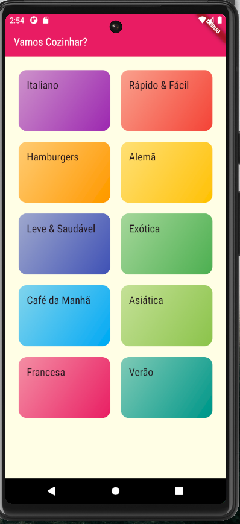
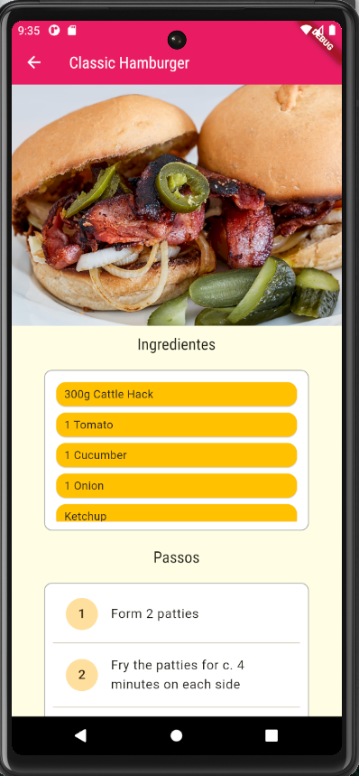

# Despesas Pessoais

Projeto em Flutter, trata-se de um menu de comidas.
A ideia é testar as rotas e stacks.

## Notas

O projeto foi desenvolvido ao longo do curso [Aprenda Flutter e Desenvolva Apps Para Android e IOS](https://www.udemy.com/share/102BJd/)

### Demo

|                                 |                                    |
| :-----------------------------: | :--------------------------------: |
|  |  |
